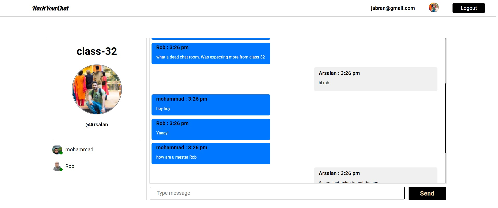
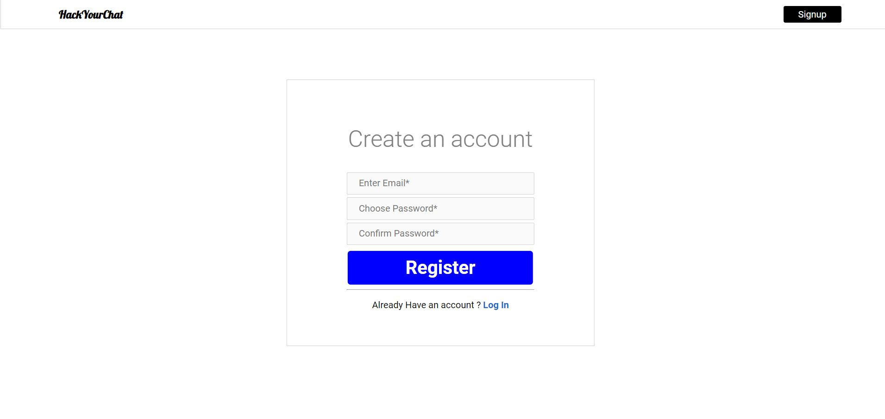
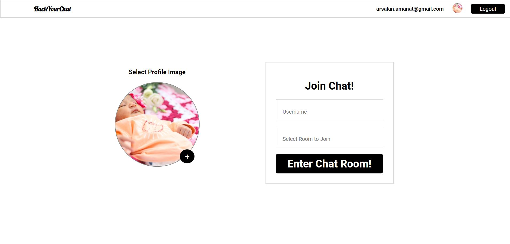

# HackYourChatApp - Reat time chat app - <a href="https://hack-your-chat-app.herokuapp.com/">Demo</a>


## General info
As an assignment of React module during my Bootcamp with Hack Your Future, I decided to make a real-time chat application where users can join rooms and chat with each other. The concept of building this application was taken from Brad Traversy. And I implemented it using the React and Context API. As well as the chat application is protected with the private route to let only authenticated users join the chat room . In the app, only the users in the room can see the chat messages that belong to the room. The chat app has an auto greet notifications system to welcome the User when they enter the chat room and also to indicate to the other users when a user leaves the chat room.




#### Deployed Link:
https://hack-your-chat-app.herokuapp.com/

#### Test Account :

- username : `hello@gmail.com` 
- password : `123456`


## The project was built Using
1. React
2. Socket.io
3. Firebase
4. Node
5. Express


## Working :

### React
The front end of the application is built using React. Only the authenticated users can enter the chatrooms. If the Users are not authenticated they will be redirected to the Login Page :


If user do not yet have an account they can make a new Account just by giving email and password:


Once the user is authenticated now they can enter the page to join the chat room . In joinChatroom route user can select their profile image , display name and the room they want to join to start the chat. 



The App also check for the error and response with the appropriate message to the user .

### Firebase :

All the user will be authenticated by firebase auth. The user can create an account as well as reset their password in case if they forget their last password.

</br>

### Want to Run on Local Machine ? 

- If you cant to run the app on your local machine clone the repository and then follow the undermentioned steps

1. Run `NPM INSTALL` to install the dependencies
2. create a `.env` file and add 

``` javascript
REACT_APP_FIREBASE_API_KEY = ""
REACT_APP_FIREBASE_AUTH_DOMAIN = ""
REACT_APP_FIREBASE_PROJECT_ID = ""
REACT_APP_FIREBASE_STORAGE_BUCKET = ""
REACT_APP_FIREBASE_MESSAGING_SENDER_ID = ""
REACT_APP_FIREBASE_APP_ID = ""
```

Add your firebase configration data 

4.  open `server.js` file and replace line 8 with  
``` javascript
const io = new Server(server, {
    cors: {
        origin: ['http://localhost:3000']
    }
}); 
```


3. The in the `hack-your-chat-app` folder go to `src/Context` and open `SocketContext.js`
4. Change `Line: 8` URL with `http://localhost/5000`
5. To start the React act in the terminal write `NPM START`
6. `cd ..`
7. In the Terminal Start Server `nodemon`


</br>

## Further Amendments to be made ?

As a result of one week task i have completed the above mentioned task but in future i want to make this app responsive and also add some more features:

1. where user can also open a private chat with each other.
2. Will have the feature to share images and videos in Chat 
3. Users can see when someone is typing 
4. Adding emojis

Please feel free to send me your feedback . I would love to hear from you . 


